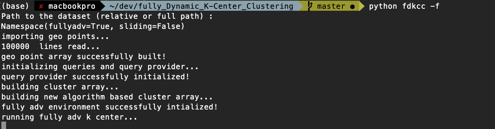
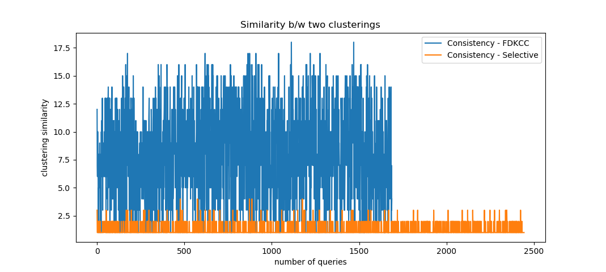
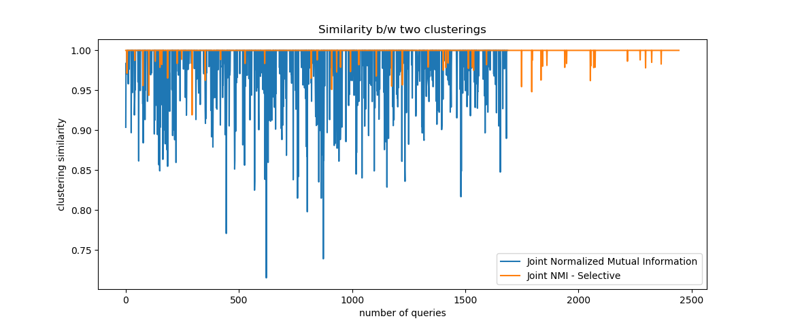
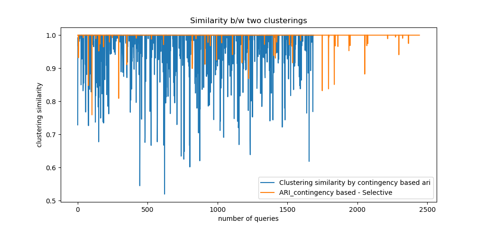

# Stabilization of Fully Dynamic K-Center Clustering

This project was motivated by Fully Dynamic k-Center Clustering (Chan et al. 2018). It aims to provide the enhancement of fully dynamic k-center clustering. 

The stability is defined as the degree of similarities between different clusterings. Stability is measured by different metrics including Consistency, ARI, and NMI.
The consistency is defined as the number of changes in centers of clusterings. ARI and NMI is defined by Pair-counting measures and contingency table measures. 


## Getting Started

These instructions will get you a copy of the project up and running on your local machine for development and testing purposes. 

### Prerequisites

What things you need to install the software and how to install them

- Python3 

### Installing

A step by step series of examples that tell you how to get a development env running

```
pip install -e . 
```

## Running the Source Code

To run the program (in fully adversarial model)
```

python fdkcc/ -f 

```

#### Flags that can be specified:

- -f , --fullyadv = Run Fully Adversarial model
- -s , --sliding = Run sliding window model


If you see the following console screen, 
the program is running successfully.



```
average of center changes : 7.686274509803922 
average of center changes for Selective : 1.2938931297709924 
average of NMI:  0.9817545560091205
average of Selective NMI:  0.9994655512106769
average of ARI:  0.5134579491675249
average of Selective ARI:  0.8591171769543855
average of contingency_ARI:  0.9720373134523597
average of contingency_Selective ARI:  0.9988657316177523

```

You will see the following graphical images when fully_adv model successfully runs,





*For sliding window model, you can specify the window length.

When the program terminates, `cluster_information.log` file will be created. This log file contains the solution for the optimal radius for the clustering.

### Break down into end to end tests

To run a full test,

```
pytest
```

You will see the result as follows
```
test/test_algo_fully_adv.py .......                                                                                                      [ 26%]
test/test_data_fully_adv.py .                                                                                                                  [ 30%]
test/test_point.py .....                                                                                                                       [ 50%]
test/test_set.py ..........                                                                                                                    [ 88%]
test/test_util.py ...                                                                                                                          [100%]
```


## Contributing

This project is motivated by [fully dynamic k-center algorithm](https://github.com/fe6Bc5R4JvLkFkSeExHM/k-center) project. Note that this project is a translation of the existing C code base. 


## Authors

* **Choi Jae Won** - *Initial work* - [github](https://github.com/choijaewon959)
* **Ha Tae Min** - *Initial work* - [github](https://github.com/taemin410)


## License

This project is licensed under the MIT License

## Acknowledgments

* Dr. Hubert Chan - hubert@cs.hku.hk 
* Shuguang Hu  - sghu@cs.hku.hk

